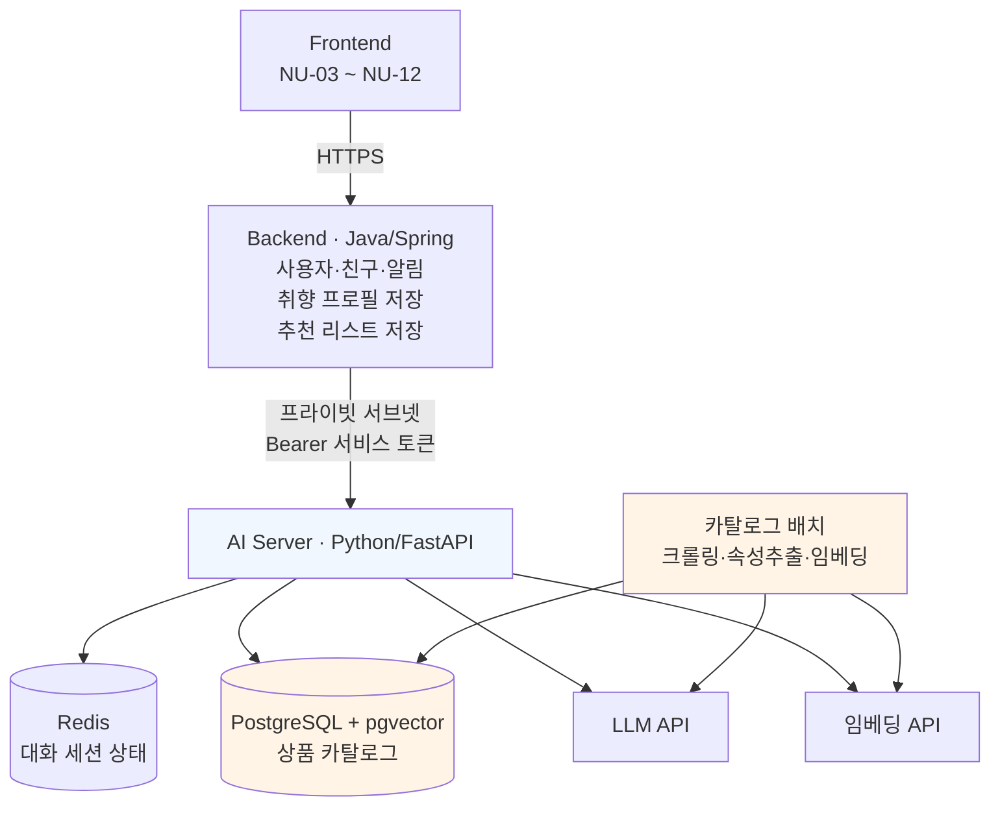
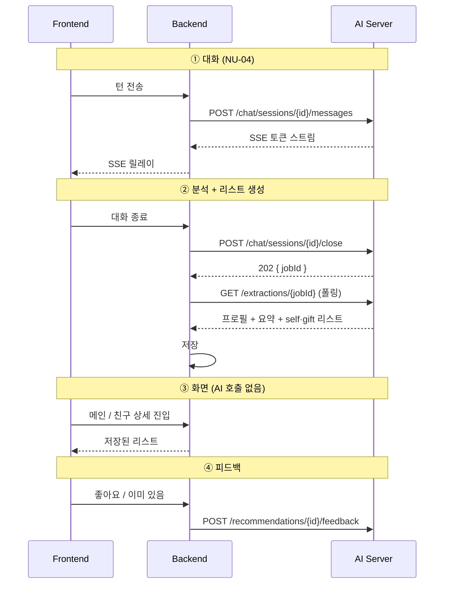

# 니쥬(Need U) — 모델 API 설계

| | |
|---|---|
| 단계 | 설계 과제 **단계 1 — 모델 API 설계** |
| 문서 버전 | v1 |
| 작성 | AI 담당 |
| 최종 수정 | 2026-09-02 |
| 상세 설계 | [ai-api-design-v3.md](./ai-api-design-v3.md) · [recommendation-logic-v1.md](./recommendation-logic-v1.md) |

> 이 문서는 **단계 1 제출용 요약본**이다. 엔드포인트·입출력·연동 구조·호출 예시만 담는다.
> 스코어 함수, 카탈로그 수집, 프롬프트 설계는 위 상세 문서에 있다.

---

## 1. 니쥬는 어떤 서비스인가

**AI와 대화하면 취향과 관심사가 분석되고, 그 조건으로 두 종류의 상품 리스트가 만들어지는 서비스다.**

| 리스트 | 보는 사람 | 화면 |
|---|---|---|
| **need** — 내게 필요한 물건 | 본인 | 메인 (NU-03) |
| **want** — 받고 싶어할 물건 | 친구 | 친구 상세 · 선물 추천 (NU-06·07) |

예시: 세제는 본인에게 필요하지만 선물로는 맞지 않고, 좋은 텀블러는 스스로 사기 애매하지만 받으면 기쁘다. **하나의 리스트로 두 목적을 만족시킬 수 없어서** 처음부터 둘로 나눈다.

---

## 2. 왜 모델 API를 따로 두는가

AI 기능을 백엔드 코드에 섞지 않고 **독립 서버 + REST API**로 분리했다. 이유는 세 가지다.

| | |
|---|---|
| **언어가 다르다** | 백엔드는 Java/Spring, AI는 Python 생태계(LLM SDK·임베딩·pgvector)가 필수다 |
| **배포 주기가 다르다** | 프롬프트 수정·랭킹 가중치 조정은 주 단위로 일어난다. 붙어 있으면 한 줄 고치는 데 백엔드 전체를 배포해야 한다 |
| **교체 가능해야 한다** | 단계 2에서 상용 API → 로컬 서빙 모델로 바꿀 계획이다. API 경계가 있으면 백엔드는 아무것도 모른 채 그대로 동작한다 |

**경계를 긋는 규칙 하나** — AI 서버는 **사용자 데이터를 저장하지 않는다.** 취향 프로필도 추천 리스트도 백엔드가 소유하고, AI 서버는 요청마다 받아서 계산하고 돌려준다. 유일한 예외는 상품 카탈로그로, 상품 벡터가 임베딩 모델 버전에 묶여 있어 AI 서버가 소유한다.

---

## 3. 전체 구조



**프론트엔드에서 AI 서버로 가는 직접 경로는 없다.** 대화 스트리밍(SSE)도 백엔드가 받아서 프론트로 릴레이한다. AI 서버는 프라이빗 서브넷에 있고 외부 인바운드가 차단된다.

---

## 4. 엔드포인트 목록

| 메서드 | 경로 | 기능 | 처리 |
|---|---|---|---|
| POST | `/v1/chat/sessions` | 대화 세션 생성, 첫 발화 반환 | 동기 |
| POST | `/v1/chat/sessions/{id}/messages` | 유저 턴 전송, 응답 스트리밍 | **SSE** |
| POST | `/v1/chat/sessions/{id}/close` | 세션 종료 → 취향 추출 + 리스트 생성 작업 시작 | 비동기 (202) |
| GET | `/v1/extractions/{jobId}` | 추출 결과 조회 (프로필 + 요약 + 두 리스트) | 폴링 |
| DELETE | `/v1/chat/sessions/{id}` | 추출 없이 세션 폐기 (이탈·취소) | 동기 |
| POST | `/v1/recommendations` | 추천 리스트 **재생성** | 동기 |
| POST | `/v1/recommendations/{id}/feedback` | 추천 피드백 수집 | 동기 |
| GET | `/health` | 헬스 체크 | 동기 |

### 이 API로 구현되는 서비스 기능

| 엔드포인트 | 서비스에서 하는 일 |
|---|---|
| `chat/*` | **취향 수집.** 폼으로 물으면 아무도 제대로 안 쓰므로 대화 형식으로 받아낸다 |
| `extractions` | **취향 분석 + 리스트 생성.** NU-04 "분석 중" 화면의 실체 |
| `recommendations` | **리스트 갱신.** 카탈로그·피드백이 바뀌었을 때 다시 만든다 |
| `feedback` | **학습 신호 수집.** 다음 리스트 생성 시 순위 보정에 쓰인다 |

---

## 5. 화면 ↔ 서버 연동

### 5.1 화면별 호출 경로

| 화면 | 프론트 → 백엔드 | 백엔드 → AI |
|---|---|---|
| NU-04 대화 | 턴 전송 (SSE 수신) | `POST /chat/sessions/{id}/messages` **릴레이** |
| NU-04 분석 중 | 진행률 폴링 | `close` → `GET /extractions/{jobId}` |
| NU-03 메인 | 리스트 조회 | **호출 없음** (저장된 `self` 리스트) |
| NU-06 친구 상세 | 취향 칩·요약·리스트 조회 | **호출 없음** |
| NU-07 선물 추천 | 리스트 조회 + 예산 조절바 | **호출 없음** (조절바는 클라이언트 필터) |
| NU-08 상품 상세 | 추천 이유 표시 | **호출 없음** (저장된 `reason` 재사용) |
| NU-08 피드백 | 좋아요·싫어요 | `POST /recommendations/{id}/feedback` |

**대화(NU-04)를 빼면 사용자가 AI 서버를 기다리는 화면이 없다.** 추천 리스트는 미리 만들어 백엔드가 저장하기 때문이다(§6).

### 5.2 전체 흐름



---

## 6. 핵심 설계 결정

### 6.1 추천 리스트는 미리 만들어 저장한다

**대안이었던 것** — 화면에 들어갈 때마다 `POST /recommendations`를 호출해 실시간 계산.

**선택** — 대화가 끝날 때 두 리스트를 만들어 백엔드가 저장하고, 화면은 조회만 한다.

**이유** — 리스트가 **프로필 주인만의 함수**라서다. 누가 언제 보든 결과가 같으므로 같은 계산을 반복할 이유가 없다. 실시간 호출을 유지하면 친구 목록을 훑는 동안 한 명 누를 때마다 추천 이유 생성(약 900ms)을 포함한 대기가 생긴다.

**리스트를 다시 만드는 시점**

| 트리거 | |
|---|---|
| 새 대화로 프로필 변경 | 필수 |
| 카탈로그 주간 배치 | 신상품 유입 |
| 피드백 누적 | 순위 보정값 변화 |
| TTL 7일 | 가격·재고 드리프트 |

### 6.2 대화는 턴마다 상태를 갱신한다

취향 항목은 대화가 끝난 뒤 한 번에 뽑는 게 아니라 **턴마다 즉시 누적**된다.

```
① Redis에서 세션 상태 로드
② [STATE] 블록 + 최근 6턴 원문으로 프롬프트 조립
③ LLM 호출 — 답변은 SSE로, 델타는 서버가 파싱
④ 병합 후 Redis에 저장
```

**즉시 반영해야 하는 이유** — `[STATE]` 블록이 모델의 유일한 기억이다. 갱신이 늦으면 이미 들은 것을 또 묻는다.

| | |
|---|---|
| 세션 저장소 | Redis (`key = sessionId`) |
| 유휴 TTL | 30분 · 최대 수명 2시간 |
| 최대 턴 | **20턴** |
| 대화 원문 | 최근 6턴만 유지 (롤링). 이전은 취향 항목으로 압축 |
| 종료 판정 | **서버가 한다.** 모델은 종료를 선언하지 않는다 |

---

## 7. 모델이 대화에서 추출하는 스키마

AI 서버 내부 스키마지만, **모델의 실제 출력 계약**이라 여기 함께 정리한다.

### 7.1 10개 배열

| 배열 | 정의 | 역할 |
|---|---|---|
| `interests` | 좋아하는 **대상** | 검색어 |
| `hobbies` | 직접 하는 **활동** | 검색어 |
| `preferences` | 상품의 **속성** 선호 (색·소재·무게·브랜드) | 순위 조정 |
| `lifestyle` | 생활 **맥락** (1인 가구·재택) | 순위 조정 |
| `wants` | 갖고 싶다고 **말한** 것 | 검색어 · want 신호 |
| `unaffordable` | 갖고 싶은데 **안 산** 것 | 검색어 · **가장 강한 선물 신호** |
| `consumables` | 떨어지면 **다시 사는** 것 | 검색어 · need 신호 |
| `owned` | 이미 **갖고 있는** 것 | 배제 |
| `dislikes` | **싫어하는** 것 | 배제 |
| `constraints` | 알레르기·사이즈 등 **안 되는** 것 | 배제 |

**헷갈리는 짝**

| 짝 | 구분 |
|---|---|
| `interests` / `hobbies` | 대상인가 활동인가 (캠핑 / 핸드드립) |
| `interests` / `preferences` | 무엇인가 어떤인가 (캠핑 / 가벼운 것) |
| `wants` / `unaffordable` | 취소가 붙었나 ("갖고 싶어" / "갖고 싶은데 비싸서") |
| `dislikes` / `constraints` | 싫은가 안 되는가 (강한 향 / 견과류 알레르기) |

### 7.2 need와 want를 가르는 기준

**감정의 세기가 아니라 문장 구조로 판별한다.**

```
NEED   "세제 다 떨어졌어"           문제 → (해결책)
WANT   "예쁘긴 한데 비싸서"          욕구 → 취소
```

필요는 스스로 해결되지만 **욕망은 보류된 채 남는다. 보류된 자리가 선물의 자리다.**

보류 이유에 따라 선물 신호의 강도가 다르다.

| `deferralReason` | 예 | 가중치 |
|---|---|---|
| `justification` | "나한테 사주긴 좀 그래" | **1.5** — 돈이 있어도 스스로 해결 안 됨 |
| `price` | "비싸서 못 샀어" | 1.4 |
| `timing` | "언젠가 사고 싶어" | 1.15 |

### 7.3 대화 → 추출 예시

> **유저**: 주말마다 캠핑 가요. 가서 커피 직접 내려 마시는 게 제일 좋아요
> → `interests: 캠핑` · `hobbies: 핸드드립`
>
> **유저**: 저는 무조건 가벼운 거. 혼자 살아서 짐 둘 데도 없고
> → `preferences: 가벼운 것` · `lifestyle: 1인 가구`
>
> **유저**: 텐트는 작년에 산 거 있어요. 근데 원두는 2주에 한 봉지씩 나가요
> → `owned: 텐트` · `consumables: 원두`
>
> **유저**: 티타늄 머그컵이요. 근데 나한테 그걸 사주긴 좀 그렇더라고요
> → `unaffordable: 티타늄 머그컵` + `deferralReason: justification`
>
> **유저**: 향 강한 건 좀... 견과류 알레르기도 있어요
> → `dislikes: 강한 향` · `constraints: 견과류 알레르기`

### 7.4 모델의 턴 출력 형식

답변을 먼저 쓰고 구분자 뒤에 이번 턴에 알게 된 것을 붙인다. **서버는 구분자 앞까지만 사용자에게 보낸다.**

```
그럼 캠핑 가시면 커피 도구도 챙겨 가시겠네요?
<<<STATE>>>
{"items":[{"value":"핸드드립","field":"hobbies","confidence":0.85,
           "evidence":"가서 커피 직접 내려 마시는 게 제일 좋아요"}],
 "axes":[],"drop":[]}
```

| 키 | 규칙 |
|---|---|
| `value` | 사용자 어휘 그대로, 최대 20자 |
| `field` | 위 10개 배열 중 하나 |
| `confidence` | 0.0~1.0 |
| `evidence` | 발화에서 잘라낸 조각, 최대 40자 |
| `drop` | 사용자가 정정해 무효가 된 기존 항목 |

**모델이 내지 않는 것은 서버가 채운다.** `linkRole`(검색/배제/가중), `visibility`(공개 범위), `intentType` 기본값은 `field`에서 결정적으로 파생되므로 매 턴 모델에게 분류시키지 않는다. 토큰이 늘고 판단이 흔들리기 때문이다.

**`value`를 정규화하지 않는 이유** — "캠핑장에서 핸드드립"을 "아웃도어 > 캠핑"으로 바꿔 저장하면 이 사람과 캠핑 영상만 보는 사람이 똑같아진다. 취향의 구체성이 곧 선물 성공률이라 이 손실이 크다.

---

## 8. 입출력 명세

### 8.1 `POST /v1/chat/sessions` — 세션 생성

**Request**

```json
{
  "userId": "u_10293",
  "existingProfile": null,
  "onboarding": {
    "seedCategories": ["아웃도어", "커피"],
    "excludeCategories": ["주류"],
    "constraints": ["견과류 알레르기"]
  }
}
```

| 필드 | 타입 | 필수 | 설명 |
|---|---|---|---|
| `userId` | string | ✓ | 사용자 식별자 |
| `existingProfile` | TasteProfile \| null | ✓ | 재대화면 기존 프로필 주입 |
| `onboarding` | object \| null | ✓ | 온보딩 수집값. 취향이 아니라 첫 질문 시드 |

**Response `201`**

```json
{
  "sessionId": "s_7a2b",
  "greeting": "안녕하세요! 요즘 어떻게 지내시는지 궁금해요.",
  "maxTurns": 20
}
```

### 8.2 `POST /v1/chat/sessions/{id}/messages` — 턴 전송 (SSE)

**Request**

```json
{ "message": "주말마다 캠핑 가요" }
```

**Response** — `text/event-stream`

```
event: token
data: {"text":"캠핑 좋죠. "}

event: token
data: {"text":"주로 어디로 다니세요?"}

event: done
data: {"turn":3,"maxTurns":20,"canClose":false,"itemCount":4}
```

| 이벤트 | 내용 |
|---|---|
| `token` | 사용자에게 보일 텍스트 조각 |
| `done` | 턴 종료. `canClose`로 종료 가능 여부 전달 |
| `error` | 실패 시 `ErrorResponse` |

**`<<<STATE>>>` 뒤의 델타는 스트림에 실리지 않는다.** 서버가 파싱해 Redis에 반영하고 버린다.

### 8.3 `POST /v1/chat/sessions/{id}/close` — 종료 및 분석 시작

**Response `202`**

```json
{ "jobId": "j_9c4d", "status": "pending", "pollAfterMs": 1000, "estimatedMs": 6000 }
```

취향 추출·요약 생성·리스트 2벌 생성이 이어서 돌기 때문에 동기로 처리하지 않는다.

### 8.4 `GET /v1/extractions/{jobId}` — 결과 조회

**Response `200` (완료)**

```json
{
  "jobId": "j_9c4d",
  "status": "succeeded",
  "profile": {
    "schemaVersion": "3.0",
    "userId": "u_10293",
    "summary": "캠핑을 다니면서 직접 커피를 내려 마시는 걸 즐깁니다. 가벼운 장비를 선호하고, 향이 강한 제품은 좋아하지 않습니다.",
    "interests": [
      {
        "value": "캠핑",
        "confidence": 0.91,
        "linkRole": "query",
        "visibility": "friends",
        "intentType": "both",
        "deferralSignal": false,
        "evidence": "주말마다 캠핑 가요",
        "taxonomyPath": ["아웃도어", "캠핑"],
        "firstSeenAt": "2026-09-02T14:32:00Z",
        "updatedAt": "2026-09-02T14:32:00Z"
      }
    ],
    "hobbies": [],
    "preferences": [],
    "lifestyle": [],
    "wants": [],
    "unaffordable": [
      {
        "value": "티타늄 머그컵",
        "confidence": 0.90,
        "linkRole": "query",
        "visibility": "friends",
        "intentType": "want",
        "deferralSignal": true,
        "deferralReason": "justification",
        "evidence": "나한테 그걸 사주긴 좀 그렇더라고요",
        "taxonomyPath": ["아웃도어", "캠핑", "캠핑식기"],
        "firstSeenAt": "2026-09-02T14:38:00Z",
        "updatedAt": "2026-09-02T14:38:00Z"
      }
    ],
    "owned": [],
    "consumables": [],
    "dislikes": [],
    "constraints": [],
    "axes": ["직접 손으로 하는 것 ↔ 자동으로 되는 것"]
  },
  "lists": {
    "self": { "...": "RecommendationResult (mode: self)" },
    "gift": { "...": "RecommendationResult (mode: gift)" }
  }
}
```

**진행 중 / 실패**

```json
{ "jobId": "j_9c4d", "status": "running", "progress": 0.6, "pollAfterMs": 1000 }
{ "jobId": "j_9c4d", "status": "failed",
  "error": { "code": "EXTRACTION_FAILED", "message": "취향 추출에 실패했습니다", "retryable": true } }
```

### 8.5 `POST /v1/recommendations` — 리스트 재생성

**화면 진입 시 호출하는 엔드포인트가 아니다.** §6.1의 트리거로 백엔드가 부른다.

**Request**

```json
{
  "userId": "u_10293",
  "mode": "gift",
  "profile": { "...": "TasteProfile 전체" },
  "excludeCategories": ["주류"],
  "excludeProductIds": ["p_881"],
  "feedbackSummary": {
    "likedProductIds": ["p_402"],
    "dislikedProductIds": ["p_119"],
    "alreadyHaveProductIds": ["p_555"]
  },
  "limit": 40
}
```

| 필드 | 필수 | 설명 |
|---|---|---|
| `mode` | ✓ | `self` \| `gift` |
| `profile` | ✓ | 백엔드가 저장한 프로필 전체 |
| `limit` | | 기본 40. 화면 노출 수가 아니라 **저장할 개수** |

**`limit`이 화면 노출 개수보다 큰 이유** — 예산 조절바가 저장된 목록 위에서 도는 클라이언트 필터라, 10개만 저장하면 예산을 좁혔을 때 결과가 0이 된다.

**Response `200`**

```json
{
  "recommendationId": "r_5f6g",
  "generatedAt": "2026-09-02T14:45:00Z",
  "mode": "gift",
  "priceRange": { "min": 12000, "max": 185000, "currency": "KRW" },
  "items": [
    {
      "productId": "p_1234",
      "title": "티타늄 더블월 머그컵 350ml",
      "price": 148000,
      "imageUrl": "https://example.com/p1234.jpg",
      "productUrl": "https://example.com/products/1234",
      "category": "캠핑식기",
      "priceBand": 3,
      "rank": 0,
      "score": 0.809,
      "reason": "직접 사기엔 조금 망설여지는 물건이에요. 캠핑에서 커피 내려 드시는 걸 좋아해서 오래 쓸 수 있는 컵을 골랐어요.",
      "matchedSignals": [
        { "field": "unaffordable", "label": "캠핑 장비", "tasteNodeId": "outdoor.camping.camping_dish" }
      ],
      "ranking": {
        "factors": { "wantSignal": 0.74, "deferralWeight": 1.5, "giftability": 0.81 },
        "rankerVersion": "gift-1.0.0"
      }
    }
  ],
  "funnel": { "retrieved": 412, "afterHardFilter": 268, "afterScoreFloor": 91, "afterDiversity": 40 }
}
```

**`gift` 응답에서는 `matchedSignals[].value`가 `null`이고 `label`만 나간다.** 원문 표현이 그대로 나가면 친구가 대화 내용을 역추론할 수 있다. 추천 이유 문구에도 보류 이유를 직접 드러내지 않는다 — "비싸서 못 사셨다고 해서"가 아니라 "직접 사기엔 조금 망설여지는 물건이에요".

### 8.6 `POST /v1/recommendations/{id}/feedback`

```json
{ "userId": "u_10293", "productId": "p_1234", "action": "already_have" }
```

| `action` | 의미 |
|---|---|
| `like` / `dislike` | 좋아요 / 싫어요 |
| `already_have` | 이미 있음 → `owned`로 이동 |
| `gift_satisfied` | 선물이 성공했음 |

---

## 9. API 호출 예시

> **아직 백엔드와 연결하지 않아 실제 호출 테스트는 진행하지 않았다.**
> 아래 응답은 스키마 확인을 위해 작성한 **예시이며 실행 결과가 아니다.**

**① 세션 생성**

```bash
curl -X POST https://ai.needu.internal/v1/chat/sessions \
  -H "Authorization: Bearer $SERVICE_TOKEN" \
  -H "Content-Type: application/json" \
  -d '{"userId":"u_10293","existingProfile":null,
       "onboarding":{"seedCategories":["아웃도어"],"excludeCategories":[],"constraints":[]}}'
```

```json
{ "sessionId": "s_7a2b", "greeting": "안녕하세요! 요즘 어떻게 지내세요?", "maxTurns": 20 }
```

**② 턴 전송 (SSE)**

```bash
curl -N -X POST https://ai.needu.internal/v1/chat/sessions/s_7a2b/messages \
  -H "Authorization: Bearer $SERVICE_TOKEN" \
  -H "Content-Type: application/json" \
  -d '{"message":"주말마다 캠핑 가요"}'
```

```
event: token
data: {"text":"캠핑 좋죠. 주로 어디로 다니세요?"}

event: done
data: {"turn":1,"maxTurns":20,"canClose":false,"itemCount":1}
```

**③ 종료 → 폴링**

```bash
curl -X POST https://ai.needu.internal/v1/chat/sessions/s_7a2b/close \
  -H "Authorization: Bearer $SERVICE_TOKEN"
```

```json
{ "jobId": "j_9c4d", "status": "pending", "pollAfterMs": 1000, "estimatedMs": 6000 }
```

```bash
curl https://ai.needu.internal/v1/extractions/j_9c4d \
  -H "Authorization: Bearer $SERVICE_TOKEN"
```

→ §8.4의 응답 형식.

**④ 리스트 재생성**

```bash
curl -X POST https://ai.needu.internal/v1/recommendations \
  -H "Authorization: Bearer $SERVICE_TOKEN" \
  -H "Content-Type: application/json" \
  -d @request.json   # profile 전체 포함
```

→ §8.5의 응답 형식.

---

## 10. 오류 처리

| HTTP | code | 의미 | 재시도 |
|---|---|---|---|
| 400 | `INVALID_REQUEST` | 스키마 위반 | ✗ |
| 401 | `UNAUTHORIZED` | 서비스 토큰 없음·불일치 | ✗ |
| 404 | `SESSION_NOT_FOUND` | 세션 없음 또는 만료 | ✗ |
| 409 | `SESSION_CLOSED` | 종료된 세션에 메시지 전송 | ✗ |
| 422 | `PROFILE_TOO_SPARSE` | 추천에 필요한 최소 신호 부족 | ✗ |
| 429 | `RATE_LIMITED` | 호출 한도 초과 | ✓ |
| 502 | `LLM_UNAVAILABLE` | LLM API 실패 | ✓ |
| 503 | `CATALOG_UNAVAILABLE` | 카탈로그 DB 접근 실패 | ✓ |

**공통 형식**

```json
{ "code": "LLM_UNAVAILABLE", "message": "일시적인 오류입니다",
  "retryable": true, "requestId": "req_8f2a" }
```

### LLM 고유 실패

모델을 쓰는 API라 일반 서버와 다른 실패가 있다. **부분 실패를 전체 실패로 만들지 않는 것**이 원칙이다.

| 상황 | 대응 |
|---|---|
| JSON 스키마 위반 | 2회 재시도 → `EXTRACTION_FAILED` |
| 응답 지연 | 타임아웃 20초, 1회 재시도 |
| 델타 파싱 실패 | **그 턴만 건너뛴다.** 답변은 이미 전달됐고 다음 턴에 다시 나온다 |
| 추천 이유 생성 실패 | 신호 나열 기본 문구로 대체. **추천 자체는 실패시키지 않는다** |
| 임베딩 실패 | 해당 항목만 건너뛰고 나머지로 검색 |

**에러가 아닌 것** — 추천 0건(200 + `emptyReason`), 취향 미확보(`canClose: false`), 택소노미 매핑 실패(`taxonomyPath: null`).

---

## 11. 인증과 권한

프론트엔드에서 AI 서버로 가는 경로가 없으므로 **AI 서버는 백엔드만 상대한다.**

| 계층 | 방식 |
|---|---|
| 네트워크 | 프라이빗 서브넷. 외부 인바운드 차단 |
| 인증 | `Authorization: Bearer {SERVICE_TOKEN}` |
| 사용자 식별 | 요청 본문의 `userId`. **AI 서버는 사용자 인증을 하지 않는다** |
| 레이트 리밋 | `userId` 기준. 대화 60회/분, 추천 10회/분 |

**시크릿** — LLM API 키·서비스 토큰·DB 접속 정보는 시크릿 매니저에서 주입한다. **로그에 요청 본문 전체를 남기지 않는다.** 대화 원문이 로그로 새면 원문 미저장 원칙이 무의미해진다.

---

## 12. 상세 설계 문서 대비 변경점

| 항목 | 이전 | 현재 | 이유 |
|---|---|---|---|
| 추천 호출 시점 | 화면 진입마다 | **대화 종료 시 1회 + 재생성 트리거** | 리스트가 수신자만의 함수라 반복 계산이 무의미 |
| `giftContext` (관계·예산·상황) | 요청 파라미터 | **삭제** | 친구 관계를 표현할 스키마가 프론트·백엔드에 없음 |
| `relationFit` · `budgetFit` | 스코어 인자 | **삭제** | 위와 동일. 예산은 클라이언트 필터로 이동 |
| `limit` | 10 | **40** | 조절바가 클라이언트 필터라 넉넉히 저장해야 함 |
| 최대 턴 수 | 문서마다 20/30 | **20으로 통일** | 사용자 피로도 |
| 세션 저장소 | "휘발성 저장소" | **Redis 명시** | 서버 재시작·다중 인스턴스 대응 |
| 상품 `giftEligible` | 없음 | **추가** | 생필품을 점수로 밀어내는 대신 gift 후보에서 하드 제외 |

---

## 13. 다음 단계와의 연결

**단계 2(추론 최적화)에서 다룰 것** — 현재 LLM은 상용 API를 기준으로 설계했다. 다음 단계에서 **로컬 서빙 모델로 전환**하며 지연·비용을 비교한다. API 경계가 이 문서에 고정되어 있으므로 **백엔드 코드는 한 줄도 바뀌지 않는다.** 이것이 모델 API를 먼저 설계한 이유다.

측정 대상은 세 곳이다.

| 구간 | 현재 특성 |
|---|---|
| 대화 턴 (SSE) | 첫 토큰 지연이 체감을 좌우 |
| 추출·요약 | 사용자가 "분석 중"으로 기다리는 유일한 구간 |
| 추천 이유 생성 | 리스트 생성에서 가장 무거움. 사전 계산으로 이미 대기 경로에서 제외됨 |

**미확정** — LLM/임베딩 모델 선정, 카테고리 사전 작성 범위, 카탈로그 초기 수집 규모.
